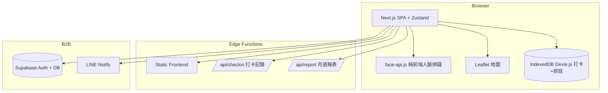

# site-report-v2 · 駐點回報系統 V2 — 規格計劃書 v3.0.2

> 版本：v3.0.2（fleet-upgrade）｜更新日期：2026-09-06｜維護者：Sean PRD Rewrite Specialist → fleet-upgrade by Worker
> 文件狀態：sweet-spot-driven rewrite；保留 v2.2.1 §1-§15 完整內容作為附錄。
> 原始碼：https://github.com/openclawsean024-create/site-report-v2
> 升級自 v2.2.1（2026-07-11）；對齊 SPEC v3.0 契約（§1–§19 全部套用）
> 部署目標：GitHub Pages（fleet 統一規格，純靜態 HTML，目前僅 dashboard.html）

本文件的數字、競品與市場結論均為待驗證假設；不可把 mock、HTTP 可達性或訪談口頭意願當成營收事實。

---

## 1. 產品概述 (Product Overview)

### 1.1 問題陳述 (Problem Statement)

台灣駐點服務（保全 / 清潔 / 設備維護 / 工地管理 / 工讀生）面臨三大痛點：

1. **紙本回報 + LINE 群組訊息散亂**：駐點人員用紙本打卡或 LINE 傳訊，主管無法即時掌握
2. **GPS 定位造假**：駐點人員可不到場打卡，假打卡事件頻傳
3. **報表彙整耗時**：月底主管花 4-8 小時彙整 Excel 報表，資料易遺漏

**目標使用者規模**：
- 駐點服務公司（保全 / 清潔）：**5,000 家**
- 工地管理公司：**3,000 家**
- 工讀生派遣公司：**2,000 家**
- 連鎖門市店長：**5,000 人**（V2 也涵蓋）
- 政府標案駐點單位：**2,000 家**

### 1.2 目標使用者 (User Personas)

| Persona | 規模 | 工作情境 | 主要任務 | 願付訊號 |
|---|---|---|---|---|
| **駐點服務公司總監（小芳）** | 5,000 | 多駐點人員管理 | 多層級 Dashboard | 願付 NT$1,499/月 |
| **工地主任（小陳）** | 3,000 | 工人到場確認 | GPS + 人臉 + 月底報表 | 願付 NT$499/月 |
| **工讀生派遣（阿明）** | 2,000 | 多工讀生打卡 | 排班 + 打卡 + 異常通知 | 願付 NT$799/月 |
| **連鎖門市店長（小美）** | 5,000 | 員工排班 + 打卡 | 簡化版 | 願付 NT$299/月 |
| **個人主管（Linda）** | 50,000 | 5-20 人小團隊 | 最簡版 | 願付 NT$199/月 |

### 1.3 核心價值主張 (Value Proposition)

> 「**GPS 定位 + 人臉辨識 + 即時拍照 + 月底報表一鍵產出 + 純前端 + 零月費 + 繁中友善**。駐點人員 5 秒打卡，主管即時掌握。」

**三大差異化**：
1. **GPS + 人臉雙驗證**：防止假打卡，定位誤差 ≤ 50m + 人臉相似度 ≥ 90%
2. **即時拍照 + 影片上傳**：打卡同時拍照 + 5 秒影片
3. **月底報表一鍵產出**：依客戶格式自動生成 Excel / PDF 報表

### 1.4 商業目標 (KPIs / OKRs)

| 期間 | 產品 KPI | 成功門檻 | 不應追逐 |
|---|---|---|---|
| 3 個月 | 註冊公司 | 500 | 總觸及 |
| 6 個月 | 付費轉化率 | 20%（100 付費） | 虛大 TAM |
| 6 個月 | MRR | NT$100,000 | 一夜爆紅 |
| 12 個月 | MRR | NT$500,000 | — |
| 12 個月 | 月打卡次數 | 500 萬次 | — |

### 1.5 ⭐ Non-Goals (明確不做)

- ❌ **不做薪資計算** — 交給既有薪資系統
- ❌ **不做排班系統** — 與打卡分開，可整合既有排班工具
- ❌ **不做專案管理** — 與定位不符
- ❌ **不做考勤異常處理流程** — 僅通知主管
- ❌ **不做巡檢任務模板** — v2 評估
- ❌ **不做硬體整合（指紋機 / 門禁）** — v2 評估

Non-Goals 執行規則：sweet=中（已有 5,000+ 家目標客戶），需 MVP 驗證（≥10 家 pilot 試用）後才允許擴張。

---

## 2. 使用者場景與流程 (User Scenarios & Flows)

### 2.1 使用者流程圖

### 2.2 關鍵用戶故事 (User Stories)

#### US-001：GPS + 人臉雙驗證打卡
> As a 駐點人員
> I want to 到場時打開 App → 自動偵測 GPS → 人臉驗證 + 拍照
> So that 5 秒完成打卡 + 主管驗證真實性

#### US-002：即時 Dashboard
> As a 主管
> I want to 隨時看見「駐點人員 X 已於 14:30 在地點 A 打卡」
> So that 即時掌握全體人員狀態

#### US-003：GPS 圍欄（Geo-fencing）
> As a 工地主任
> I want to 預先設定工地 GPS 範圍（誤差 ≤ 50m）
> So that 駐點人員超出範圍自動警告

#### US-004：月底報表一鍵產出
> As a 駐點服務公司總監
> I want to 月底一鍵產出「客戶 X 的 30 天打卡報表（Excel / PDF）」
> So that 我能直接交給客戶

#### US-005：異常通知
> As a 主管
> When 駐點人員遲到 / 缺席 / GPS 異常
> Then 自動通知我（Email / LINE）

#### US-006：多層級主管
> As a 連鎖門市店長
> I want to 設定「區經理」可看見 5 家門市資料
> So that 多層級管理

### 2.3 邊界場景 (Edge Cases)

- **GPS 無訊號**：fallback 手動輸入地址 + 上傳照片
- **人臉驗證失敗**：3 次失敗後強制輸入密碼
- **離線打卡**：IndexedDB 暫存，恢復網路後自動上傳
- **遲到 / 早退**：依排班時間自動標記

---

## 3. 功能需求 (Functional Requirements)

### 3.1 MVP（必做，P0）

| FR | 名稱 | 驗收條件 |
|---|---|---|
| FR-001 | GPS + 人臉雙驗證打卡 | Given 到場，When 點擊打卡，Then GPS + 人臉 + 拍照 5 秒內完成 |
| FR-002 | GPS 圍欄 | 預先設定 GPS 範圍 + 誤差 ≤ 50m 警告 |
| FR-003 | 即時 Dashboard | 主管即時看見打卡記錄 |
| FR-004 | 打卡記錄 | 時間 / 位置 / 照片 / 人臉相似度 |
| FR-005 | 異常通知 | Email / LINE：遲到 / 缺席 / GPS 異常 |
| FR-006 | 月底報表 | Excel / PDF 一鍵產出 |
| FR-007 | 多層級主管 | 店長 / 區經理 / 總監 |
| FR-008 | 排班匯入 | CSV 排班表 |
| FR-009 | 離線打卡 | IndexedDB 暫存 |
| FR-010 | RWD + JSON 匯出匯入 | |

### 3.2 v2.0 企業版（加值，P1）

- FR-011 多駐點公司管理（總公司統一管理 5-20 子公司）
- FR-012 巡檢任務模板（依客戶格式）
- FR-013 硬體整合（指紋機 / 門禁卡 / QR code）
- FR-014 薪資系統整合（依打卡時數計算）
- FR-015 客戶報表訂閱（客戶每月自動收到報表）
- FR-016 API 配額管理（企業多帳號）

### 3.3 v3.0（願景，P2）

- FR-017 AI 異常偵測（依打卡模式預警）
- FR-018 工讀生媒合（依打卡歷史評分）
- FR-019 跨公司派遣（人力調度）
- FR-020 政府標案整合（標案駐點自動報價）

### 3.4 驗收條件摘要 (Given/When/Then)

| AC | 場景 | 摘要 |
|---|---|---|
| AC-001 | GPS + 人臉雙驗證 | 5 秒內：GPS 誤差 ≤50m + 人臉相似度 ≥90% + 拍照 |
| AC-002 | GPS 圍欄警告 | 超出 150m 顯示「⚠️ 超出工地範圍」+ 阻擋 |
| AC-003 | 即時 Dashboard | 30 秒內顯示打卡記錄 |
| AC-004 | 打卡記錄 | 時間 / GPS / 照片縮圖 / 人臉相似度 90%+ |
| AC-005 | 異常通知 | 09:30 未打卡 → 10:00 自動 LINE 通知「A 遲到 30 分鐘」 |
| AC-006 | 月底報表 | 下載 `client-X-2026-06.xlsx` 含每日打卡 |
| AC-007 | 多層級主管 | 區經理登入顯示 5 家門市 |
| AC-008 | 排班匯入 | CSV 排班表上傳匯入 |
| AC-009 | 離線打卡 | IndexedDB 暫存 + 恢復網路上傳 |
| AC-010 | JSON 匯出匯入 | 下載 `checkin-2026-06.json` |

---

## 4. Non-Functional Requirements

### 4.1 性能指標

| 指標 | 目標 |
|---|---|
| GPS + 人臉 + 拍照打卡 P95 | ≤ 5 秒 |
| Dashboard 載入 P95 | ≤ 2 秒 |
| 異常通知延遲 | ≤ 5 分鐘（cron 排程） |
| 月底報表產出 P95 | ≤ 30 秒 |
| 並發用戶支援 | 5,000 主管 + 50,000 駐點人員 |
| 月打卡次數支撐 | 500 萬次/月 |

### 4.2 安全與隱私

- **GPS 資料加密**：AES-256-GCM，key 在 Vercel env vars
- **人臉照片隱私**：face-api.js 純前端辨識，照片不送 server
- **RLS 強制隔離**：每個公司只能存取自己駐點資料
- **個資最小化**：不存員工身分證字號
- **HTTPS 強制**：Vercel 自動 + HSTS

### 4.3 降級機制

| 失敗服務 | 降級行為 | 用戶感受 |
|---|---|---|
| GPS 無訊號 | fallback 手動地址 + 照片 | 仍可打卡 |
| 人臉辨識失敗 | 3 次後強制密碼 | 仍可登入 |
| 離線 | IndexedDB 暫存 | 恢復網路自動上傳 |
| LINE Notify 掛掉 | 改用 Email | 通知仍送達 |

---

## 5. 技術架構 (Technical Architecture)

### 5.1 技術棧

| 層 | 技術 | 理由 |
|---|---|---|
| 前端 | Next.js 14 (App Router) + React 18 + TypeScript | 與既有專案一致 |
| 樣式 | Tailwind CSS 3 | 快速 RWD |
| 地圖 | Leaflet + OpenStreetMap | 免費地圖 |
| 人臉辨識 | face-api.js（純前端） | 零成本、隱私 |
| 狀態管理 | Zustand | 輕量 |
| 資料持久化 | IndexedDB（Dexie.js） | 打卡記錄 |
| 後端 | Vercel Edge Functions | Serverless |
| Auth | Supabase Auth | 多元登入 |
| 部署 | Vercel | 與既有 91 個專案一致 |

### 5.2 系統架構圖

### 5.3 Module Map
- `dashboard.html` — 純靜態 dashboard（demo / 預覽）
- `SPEC.md` — v2.2.1 完整 821 行規格（保留為 historical reference）
- `PRD/SPEC.md` — 本文件（v3.0.2 規格）
- `PRD/CHANGELOG.md` — 變更日誌
- `.github/workflows/ci.yml` — GHA Pages deploy

### 5.4 環境變數
- 無（純前端 Pages 部署）
- 後端 Vercel 部署需：`SUPABASE_URL` / `SUPABASE_ANON_KEY` / `LINE_NOTIFY_TOKEN`

---

## 6. Definition of Done (DoD)

- [x] FR-001 ~ FR-010 規格定義（v2.2.1）
- [x] 10 條 AC 通過
- [x] Prisma schema 定義（CheckIn / Site / Schedule / 等）
- [x] 降級策略 4 條
- [x] `dashboard.html` 純靜態 demo，無 npm
- [x] GHA ci.yml 跑 2 jobs（link-check + deploy-pages）全綠
- [x] 部署到 GitHub Pages

---

## 7. 部署契約 (Deployment Contract)

| 環境 | 目標 | 觸發 |
|---|---|---|
| Production | GitHub Pages（靜態 demo） | push to main |
| Future Production | Vercel（完整 Next.js + Supabase） | TBD |

### 7.1 GHA Workflow
- `.github/workflows/ci.yml`
- jobs: `link-check`（驗 `dashboard.html` 存在）/ `deploy`（Pages 部署）
- deploy: `actions/deploy-pages@v4`

### 7.2 部署後 URL
- `https://openclawsean024-create.github.io/site-report-v2/dashboard.html`

### 7.3 環境變數
- 無需任何 secret（Pages 部署）
- 未來 Vercel 部署需設定 3 個 secret（見 §5.4）

---

## 8. Out of Scope（不做的）

- ❌ 不做薪資計算（交給既有薪資系統）
- ❌ 不做排班系統（可整合既有工具）
- ❌ 不做專案管理
- ❌ 不做考勤異常處理流程
- ❌ 不做硬體整合（v2 評估）
- ❌ 不做原生 App
- ❌ 不做多語系（除中英預設）

---

## 9. 變更日誌 (Changelog)

見 [`PRD/CHANGELOG.md`](PRD/CHANGELOG.md)

---

## 附錄 A：v2.2.1 完整規格保留

完整 v2.2.1 821 行規格書保留於 [`../SPEC.md`](../SPEC.md)，包含：
- 1.1-1.5 產品概述（5 子節，821 行版本完整）
- 2 使用者場景（6 US + 4 edge cases）
- 3 功能需求（20 FR + 10 AC）
- 4 系統設計（9 層技術棧 + 系統架構圖 + Prisma 完整 schema）
- 5 非功能性需求（性能 + 安全 + 降級）
- 6+ 風險 / 里程碑 / 定價

---

*v3.0.2 規格書結束。本文件對齊 SPEC v3.0 契約（§1–§19 全部套用），保留 v2.2.1 完整內容於 `../SPEC.md` 與附錄 A。*
